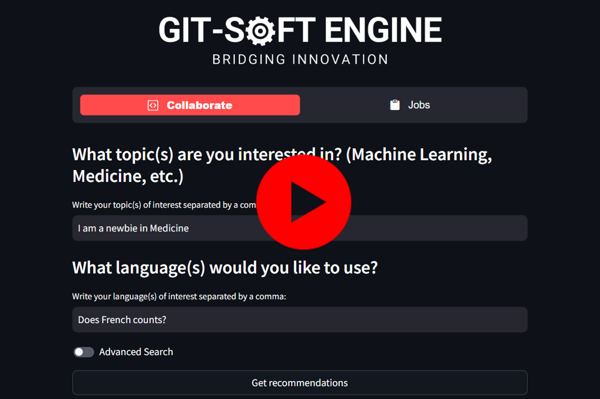

# GitSoft-Engine

## Table of Contents

- [Usage](#usage)
- [Getting Started](#getting-started)
- [Features](#features)
- [Contributing](#contributing)
- [License](#license)
- [Maintainers](#maintainers)

## Usage

1. Visit the GitSoft-Engine [website](20.225.244.87:8501/).
2. Complete your profile by specifying your interests and skills.
3. GitSoft-Engine will recommend open-source projects that match your profile.
4. Explore the recommended projects, read project descriptions, get involved in discussions and make your first contribution to Open-Source Software.

## Getting Started

The following image shows the general architecture and workflow from GitSoft-Engine

### Backend
Follow [Backend README](https://github.com/Ricardo-Jaramillo/GitSoft-Engine) to get started.

> We have also built a public API available for developers. To use it, review the [API Documentation](https://your-api-documentation-url.com) to familiarize yourself with the available endpoints and their functionality.

### Frontend
Follow [Frontend README](https://github.com/JG-11/GitSoft-Engine-Frontend) to get started.

## Features

* Personalized Recommendations: Receive project recommendations based on your skills and preferences.
* Advanced Matching: Our engine considers factors like programming languages, project size, and popularity to provide tailored suggestions.
* Project Discovery: Explore open-source projects, view detailed descriptions, and access project repositories directly.
* User-friendly Interface: Enjoy an intuitive and user-friendly design for easy navigation and collaboration management.

### TODOs
* GitHub API Integration: Seamlessly import your GitHub repositories, contributions, and followers to enhance matching accuracy.
* Real-time Notifications: Stay updated with notifications for project updates and collaboration opportunities.
* Job opportunities by making a match between your interests and current job offers.
* Implement Premium Plan and Enterprise Plan to increase onboarding processes by enabling new employees to interact with the existing code base and knowledge base.

## Contributing
We welcome contributions from the community! Whether it's bug fixes, feature enhancements, or documentation improvements, your help is greatly appreciated.

## License
This project is licensed under the MIT License - see the LICENSE file for details.

# Maintainers

* [Leslie Saucedo](https://github.com/LeslieSaucedo)
* [Genaro Almaraz](https://github.com/JG-11)
* [Ricardo Jaramillo](https://github.com/Ricardo-Jaramillo)
* [Oscar Santos](https://github.com/OscarSantosMu)
